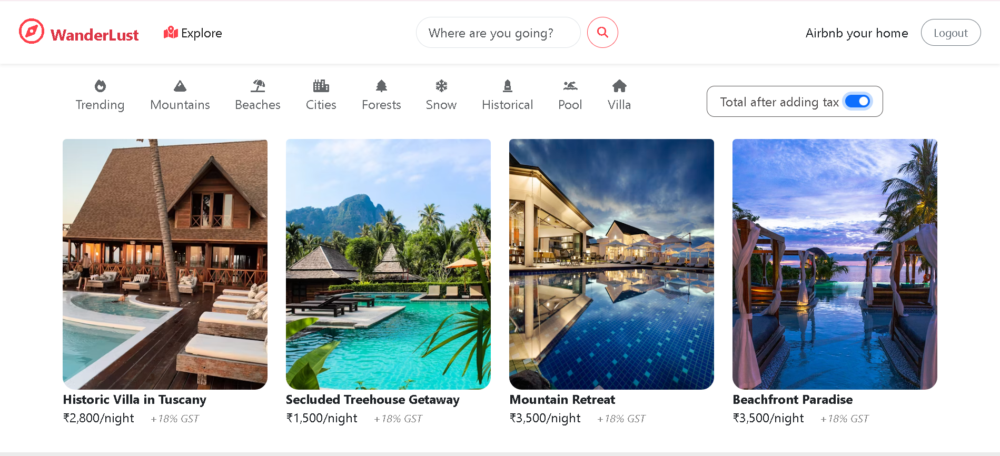

# 🏡 WanderLust – Airbnb Clone

WanderLust is a web application inspired by Airbnb. It enables users to create, explore, and book property listings. The app offers a smooth experience with image uploads, secure authentication, user reviews.




---

## ✨ Features

### 🧑‍💼 User Experience
- **User Authentication**: Sign up, log in, and log out securely using Passport.js.
- **Create Listings**: Authenticated users can add new listings with location, images (via Cloudinary), and details.
- **Browse & View Listings**: Visitors can explore properties with full details and photos.
- **Review System**: Logged-in users can post, edit, or delete reviews on listings.
- **Flash Messages**: Immediate user feedback on success/failure actions.
- **Responsive UI**: Mobile-first design using Bootstrap and custom styles.

### ⚙️ Technical Features
- **Image Uploads** via Cloudinary
- **MongoDB Validation** with Joi
- **Route Protection** using custom middleware
- **RESTful Routes** for listings and reviews
- **Templating** with EJS and Express layout

---

## 🧠 Technologies Used

### Backend
- **Node.js** – Runtime environment
- **Express.js** – Server-side web framework
- **MongoDB** + **Mongoose** – NoSQL database & modeling

### Frontend
- **EJS** – Templating engine
- **Bootstrap** – Frontend framework for responsive design

### Third-Party Services
- **Cloudinary** – Image upload & hosting
- **Passport.js** – Authentication middleware

---

## 📁 Project Structure

```
WanderLust/
├── app.js
├── cloudConfig.js
├── schema.js
├── middleware.js
├── models/
│   ├── listing.js
│   ├── review.js
│   └── user.js
├── controllers/
│   ├── listings.js
│   ├── users.js
│   └── reviews.js
├── routes/
│   ├── listing.js
│   ├── review.js
│   └── user.js
├── views/
│   ├── listings/
│   ├── users/
│   ├── partials/
│   └── error.ejs
├── public/
│   └── (static CSS, JS, images)
├── utils/
│   └── ExpressError.js
└── .env
```

---

## ⚙️ Installation Guide

### 1. Clone the Repository

```bash
git clone https://github.com/gityashhub/WandeLust-Airbnb-.git
cd WandeLust-Airbnb-
```

### 2. Install Dependencies

```bash
npm install
```

### 3. Configure Environment Variables

Create a `.env` file in the root directory and add:

```env
ATLASDB_URL=your_mongodb_url
SECRET=your_session_secret
CLOUD_NAME=your_cloudinary_name
CLOUD_API_KEY=your_cloudinary_api_key
CLOUD_API_SECRET=your_cloudinary_api_secret
```

### 4. Run the App

```bash
node app.js
```

Open `http://localhost:7000` in your browser.

---

## 🧪 Testing the App

- Sign up and create a listing
- Upload property images
- View detailed listings 
- Leave reviews on listings
- Try editing/deleting your listing/review

---

## 🔧 Future Enhancements

- Integrated payment system
- Email notifications
- Save/favorite listings
- Admin dashboard
- Filtering and sorting options for listings

---

## 🤝 Contribution Guide

1. Fork this repo
2. Create a new branch (`git checkout -b feature-branch`)
3. Commit your changes (`git commit -m 'Add new feature'`)
4. Push to your branch (`git push origin feature-branch`)
5. Open a Pull Request

---

## 📄 License

This project is open-source and available under the [MIT License](LICENSE).

---

## 🙌 Acknowledgements

- Inspired by **Airbnb**
- Image hosting by **Cloudinary**
